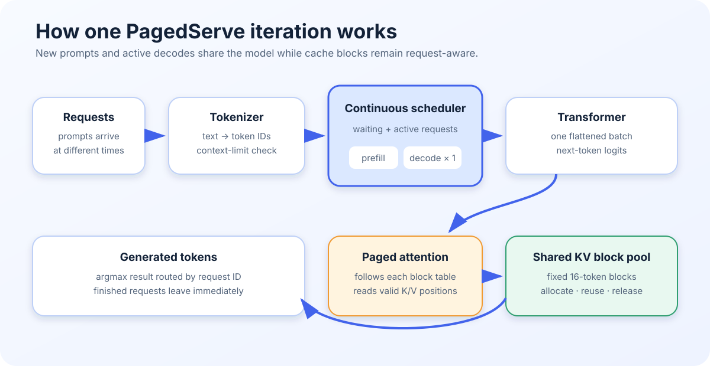
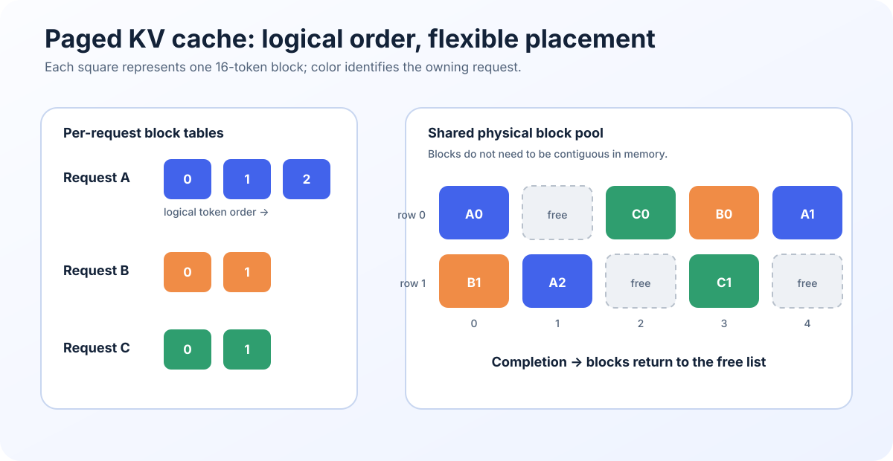

# PagedServe: Understanding Efficient LLM Inference

Large language models generate text one token at a time. Serving several users efficiently is therefore not only a model problem—it is also a **scheduling and memory-management problem**. PagedServe is a compact PyTorch project that demonstrates both ideas with GPT-2, DistilGPT-2, and a small reference transformer.



## What PagedServe does

- Accepts multiple text-generation requests.
- Combines new prompts and active generations in the same model iteration.
- Stores attention history in reusable, fixed-size KV-cache blocks.
- Releases those blocks as soon as a request finishes.
- Supports Orca-style continuous batching and simplified Sarathi-style chunked prefill.
- Runs on CPU or CUDA and provides both a CLI and a Streamlit interface.

## Why the KV cache matters

During generation, every new token attends to all earlier tokens. Recomputing their keys and values on every step would waste time, so inference engines keep them in a **key-value (KV) cache**.

A simple cache reserves one large contiguous region for each request. That region is often partly empty, especially when requests have different lengths. PagedServe instead divides the cache into **16-token physical blocks**.



The request owns a small block table rather than one continuous memory region:

- Logical blocks preserve the token order seen by the model.
- Physical blocks may live anywhere in the shared pool.
- A new block is allocated only when the current block becomes full.
- Paged attention follows the block table and reads only valid token positions.
- When generation ends, every block used by that request returns to the free pool.

This design reduces internal waste and allows cache memory to be reused quickly.

## Continuous batching

Traditional static batching waits for every sequence in a batch to finish. Short requests therefore remain tied to long ones. PagedServe schedules work at the **iteration level** instead:

1. A prompt enters the waiting queue and the scheduler checks whether enough KV blocks can be reserved.
2. The prefill phase processes the prompt and stores its keys and values.
3. Each decode iteration adds one generated token to every selected active request.
4. Newly arrived prompts can join later iterations while existing requests continue decoding.
5. Completed requests leave immediately and release their cache blocks.

The scheduler flattens the selected prompt and decode tokens into one iteration batch. Each item keeps its request ID, phase, positions, and offsets, so the model can route results back to the correct request.

## Orca and Sarathi strategies

| Strategy | Main idea | Best fit |
| --- | --- | --- |
| **Orca** | Mixes full prompt prefills and one-token decodes in each iteration. | Simple continuous batching and short-to-medium prompts. |
| **Sarathi-style** | Admits at most one prompt chunk, then fills remaining slots with decodes. | Limiting the pause caused by a newly arriving long prompt. |

Chunking introduces a trade-off: active decodes experience shorter interruptions, but the new prompt may wait longer for its first token. In the project’s Apple M4 experiment, Sarathi-style scheduling reduced the median long-prefill decode interruption by **59.7%**, while increasing the new prompt’s median time to first token by **66.5%**.

## Inside the project

- `src/model/kv_manager.py` owns the physical block pool, request block tables, allocation, writes, and cleanup.
- `src/model/paged_attention.py` gathers cached keys and values for PyTorch attention; an optional Triton decode backend is available on supported CUDA systems.
- `src/scheduler/orca_scheduler.py` manages waiting, active, and finished requests and builds iteration batches.
- `src/model/paged_decoder.py` implements the reference decoder-only transformer.
- `src/model/gpt2.py` adapts pretrained GPT-2-family weights to the serving pipeline.
- `benchmark.py` and `comparison_benchmark.py` measure latency, throughput, TTFT, TPOT, and memory behavior.
- `app.py` exposes the system through a small Streamlit interface.

## What the benchmarks show

The repository’s measurements demonstrate the value of batching without hiding its limits. On a Tesla T4 at 16 requests per second with 128 input and 32 output tokens, PagedServe Orca produced **423.73 output tokens/s**, compared with **122.10 tokens/s** for the sequential Hugging Face baseline. The same report also shows that production-focused vLLM remains substantially faster in several workloads.

These results make the project useful as an educational bridge: it exposes the mechanisms behind modern LLM serving in readable PyTorch code while providing correctness checks and common-engine benchmarks.

## Running it

```bash
cd pagedserve
./env.sh
source .venv/bin/activate
PYTHONPATH=. python -m streamlit run app.py
```

PagedServe is not intended to replace a production runtime. It is a focused implementation for learning how **continuous batching, paged attention, cache admission, and chunked prefill** work together in an LLM inference engine.
